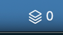

# Claude Cache Monitor

[中文说明](./README.zh-CN.md)

Claude Cache Monitor is a local macOS helper for Claude Code when Claude is routed through OpenRouter.

It has two parts:

- `openrouter-ttl-1h-proxy.mjs`: a local HTTP proxy on `127.0.0.1:3456` that forwards Anthropic Messages API traffic to OpenRouter, injects a stable `session_id`, and forces Opus prompt cache TTLs to `1h`.
- `ClaudeCacheStatusApp`: a SwiftUI menu bar app that polls the proxy status endpoint and shows active cache writes, TTL remaining, token totals, and cost totals.

## Screenshot



The screenshot shows the menu bar idle state: the proxy is healthy and there are currently `0` active cache writes.

## Why This Project Matters

- Claude Code through OpenRouter can be opaque: it is hard to tell whether prompt cache writes are active, how long they remain useful, and whether a session is reusing cache effectively.
- Opus cache TTL behavior matters for long coding sessions. This proxy consistently requests a `1h` ephemeral cache TTL for Opus models while leaving non-Opus models unchanged.
- Stable session IDs make cache behavior easier to reason about across repeated Claude Code requests.
- The menu bar app turns cache state into a visible operational signal: active writes, TTL remaining, token totals, cache read/write totals, cost, and a 24-hour write trend.
- Everything runs locally. The project does not add an external telemetry service; it only forwards the API traffic you already send to OpenRouter.

## Features

- Local-only proxy status endpoint at `GET /__status`
- Opus-only cache control rewrite to `{ "type": "ephemeral", "ttl": "1h" }`
- No cache-control changes for non-Opus models
- Session tracking from request body, `x-session-id`, or deterministic derivation
- Persistent local metrics in `~/Library/Application Support/claude-openrouter-ttl-1h/state.json`
- Native macOS menu bar monitor with a 24-hour cache-write trend chart
- launchd install and uninstall scripts for automatic login startup

## Requirements

- macOS 13 or newer
- Node.js 20 or newer
- Swift toolchain with Swift Package Manager
- Claude Code configured to use OpenRouter
- An OpenRouter API key

## Quick Start

Build and install the proxy plus menu bar app as LaunchAgents:

```bash
npm run install:launchd
```

Check the proxy:

```bash
curl -fsS http://127.0.0.1:3456/__status | python3 -m json.tool
```

Run Claude Code through the local proxy:

```bash
export ANTHROPIC_BASE_URL="http://127.0.0.1:3456"
export ANTHROPIC_AUTH_TOKEN="$OPENROUTER_API_KEY"
export ANTHROPIC_API_KEY=""
claude
```

Uninstall the LaunchAgents:

```bash
npm run uninstall:launchd
```

## Manual Development

Run the proxy in the foreground:

```bash
npm start
```

Build the menu bar app:

```bash
npm run build:menubar
```

Run all checks:

```bash
npm run check
```

## Configuration

The proxy supports these environment variables:

| Variable | Default | Purpose |
| --- | --- | --- |
| `CLAUDE_CACHE_HOST` | `127.0.0.1` | Local bind host |
| `CLAUDE_CACHE_PORT` | `3456` | Local bind port |
| `CLAUDE_CACHE_APP_SUPPORT_DIR` | `~/Library/Application Support/claude-openrouter-ttl-1h` | Default app support directory |
| `CLAUDE_CACHE_STATE_FILE` | `~/Library/Application Support/claude-openrouter-ttl-1h/state.json` | Persistent metrics file |
| `CLAUDE_CACHE_VERBOSE` | `false` | Enable verbose proxy logs with `1`, `true`, `yes`, or `on` |
| `OPENROUTER_BASE_URL` | `https://openrouter.ai/api` | Upstream OpenRouter API base URL |

The menu bar app supports:

| Variable | Default | Purpose |
| --- | --- | --- |
| `CLAUDE_CACHE_STATUS_URL` | `http://127.0.0.1:3456/__status` | Proxy status endpoint |

For launchd installs, pass overrides when running the installer:

```bash
CLAUDE_CACHE_PORT=4567 npm run install:launchd
```

Then point Claude Code at the same port:

```bash
export ANTHROPIC_BASE_URL="http://127.0.0.1:4567"
```

## Project Layout

```text
.
├── .github/workflows/ci.yml
├── docs/assets/status-bar-screenshot.png
├── launchd/
│   ├── com.qi.claude-cache-status.plist.template
│   └── com.qi.claude-openrouter-ttl-1h.plist.template
├── menubar-app/
│   ├── Package.swift
│   └── Sources/ClaudeCacheStatusApp/main.swift
├── scripts/
│   ├── install-launchd.sh
│   └── uninstall-launchd.sh
├── test/proxy.test.mjs
├── openrouter-ttl-1h-proxy.mjs
├── package.json
├── README.md
└── README.zh-CN.md
```

## Logs

Proxy logs:

```text
~/Library/Logs/claude-openrouter-ttl-1h.log
~/Library/Logs/claude-openrouter-ttl-1h.error.log
```

Menu bar app logs:

```text
~/Library/Logs/claude-cache-status.log
~/Library/Logs/claude-cache-status.error.log
```

## Troubleshooting

Check LaunchAgent status:

```bash
launchctl print gui/$(id -u)/com.qi.claude-openrouter-ttl-1h
launchctl print gui/$(id -u)/com.qi.claude-cache-status
```

Restart both services:

```bash
launchctl kickstart -k gui/$(id -u)/com.qi.claude-openrouter-ttl-1h
launchctl kickstart -k gui/$(id -u)/com.qi.claude-cache-status
```

If sessions do not appear, verify that Claude Code is using `ANTHROPIC_BASE_URL=http://127.0.0.1:3456` and that the request path is `/v1/messages`.

## License

MIT
