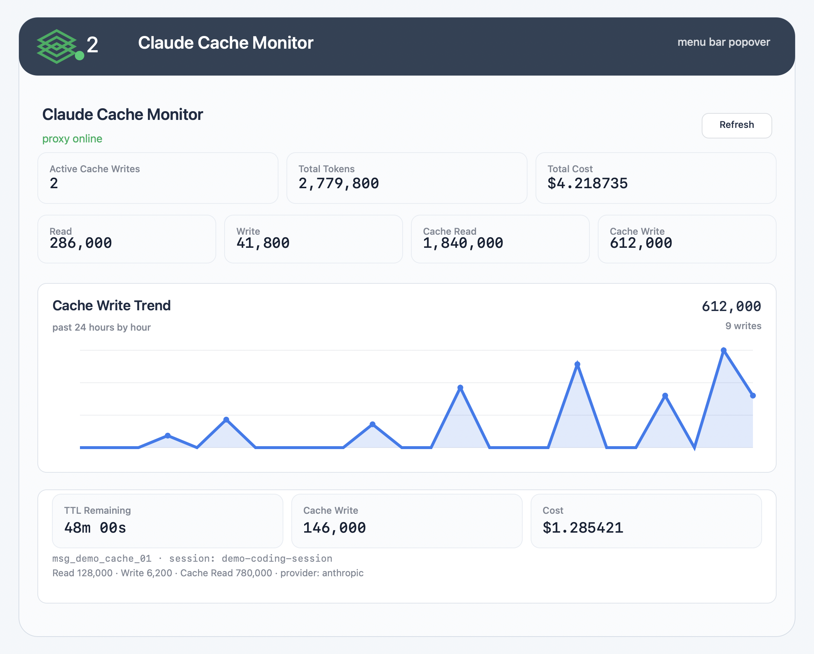

# Claude Cache Monitor

[English](./README.md)

Claude Cache Monitor 是一个面向 macOS 的本地辅助工具，用于在 Claude Code 通过 OpenRouter 访问 Claude 时，让 prompt cache 的状态变得可见、可控、可验证。

它包含两个组件：

- `openrouter-ttl-1h-proxy.mjs`：运行在 `127.0.0.1:3456` 的本地 HTTP 代理，转发 Anthropic Messages API 请求到 OpenRouter，注入稳定的 `session_id`，并仅对 Opus 模型强制使用 `1h` prompt cache TTL。
- `ClaudeCacheStatusApp`：原生 SwiftUI 菜单栏应用，轮询代理的状态接口，展示活跃缓存写入、TTL 剩余时间、token 汇总和成本汇总。

## 状态栏截图



截图使用脱敏示例数据，展示菜单栏展开面板里能看到的内容：代理健康状态、活跃缓存写入数、token 汇总、成本、24 小时缓存写入趋势，以及单次活跃缓存写入详情。

## 主要价值

- **让 OpenRouter 下的 Claude Code 缓存状态可见。** 原本你很难判断当前请求是否写入了 prompt cache、缓存还有多久失效、后续请求是否真的命中了缓存。
- **让 Opus 长上下文编码会话更稳定。** 项目会对 Opus 模型统一请求 `1h` ephemeral cache TTL，减少缓存窗口过短导致的重复写入和上下文成本浪费。
- **保留非 Opus 模型的原始行为。** 代理只改 Opus 请求的 cache control，不会擅自改 Sonnet、Haiku 或其它模型请求。
- **用稳定 session ID 降低排查成本。** 请求体、`x-session-id` 或确定性派生 session ID 都会进入本地统计，便于观察同一会话的缓存读写表现。
- **把缓存变成可操作信号。** 菜单栏里可以直接看到活跃写入数、TTL、token、成本和 24 小时缓存写入趋势，适合长期运行。
- **默认本地运行。** 除了你本来就会发送给 OpenRouter 的 API 流量，本项目不引入额外远端遥测服务。

## 功能

- 本地状态接口：`GET /__status`
- 仅对 Opus 请求把 cache control 改写为 `{ "type": "ephemeral", "ttl": "1h" }`
- 非 Opus 请求不改写 cache control
- 支持从请求体、`x-session-id` 或确定性指纹派生 session
- 本地持久化统计文件：`~/Library/Application Support/claude-openrouter-ttl-1h/state.json`
- 原生 macOS 菜单栏监控和 24 小时缓存写入趋势图
- 提供 launchd 安装/卸载脚本，可随登录自动启动

## 环境要求

- macOS 13 或更新版本
- Node.js 20 或更新版本
- Swift 工具链和 Swift Package Manager
- Claude Code 已配置为通过 OpenRouter 使用 Claude
- OpenRouter API key

## 快速开始

构建并安装代理和菜单栏应用为 LaunchAgents：

```bash
npm run install:launchd
```

检查代理状态：

```bash
curl -fsS http://127.0.0.1:3456/__status | python3 -m json.tool
```

让 Claude Code 通过本地代理运行：

```bash
export ANTHROPIC_BASE_URL="http://127.0.0.1:3456"
export ANTHROPIC_AUTH_TOKEN="$OPENROUTER_API_KEY"
export ANTHROPIC_API_KEY=""
claude
```

卸载 LaunchAgents：

```bash
npm run uninstall:launchd
```

## 本地开发

前台运行代理：

```bash
npm start
```

构建菜单栏应用：

```bash
npm run build:menubar
```

运行全部检查：

```bash
npm run check
```

## 配置

代理支持以下环境变量：

| 变量 | 默认值 | 说明 |
| --- | --- | --- |
| `CLAUDE_CACHE_HOST` | `127.0.0.1` | 本地监听地址 |
| `CLAUDE_CACHE_PORT` | `3456` | 本地监听端口 |
| `CLAUDE_CACHE_APP_SUPPORT_DIR` | `~/Library/Application Support/claude-openrouter-ttl-1h` | 默认应用支持目录 |
| `CLAUDE_CACHE_STATE_FILE` | `~/Library/Application Support/claude-openrouter-ttl-1h/state.json` | 持久化统计文件 |
| `CLAUDE_CACHE_VERBOSE` | `false` | 设为 `1`、`true`、`yes` 或 `on` 可启用详细日志 |
| `OPENROUTER_BASE_URL` | `https://openrouter.ai/api` | OpenRouter 上游 API 地址 |

菜单栏应用支持：

| 变量 | 默认值 | 说明 |
| --- | --- | --- |
| `CLAUDE_CACHE_STATUS_URL` | `http://127.0.0.1:3456/__status` | 代理状态接口 |

安装 launchd 服务时可以传入覆盖项：

```bash
CLAUDE_CACHE_PORT=4567 npm run install:launchd
```

然后把 Claude Code 指向相同端口：

```bash
export ANTHROPIC_BASE_URL="http://127.0.0.1:4567"
```

## 项目结构

```text
.
├── .github/workflows/ci.yml
├── docs/assets/status-panel-screenshot.png
├── launchd/
│   ├── com.qi.claude-cache-status.plist.template
│   └── com.qi.claude-openrouter-ttl-1h.plist.template
├── menubar-app/
│   ├── Package.swift
│   └── Sources/ClaudeCacheStatusApp/main.swift
├── scripts/
│   ├── install-launchd.sh
│   └── uninstall-launchd.sh
├── test/proxy.test.mjs
├── openrouter-ttl-1h-proxy.mjs
├── package.json
├── README.md
└── README.zh-CN.md
```

## 日志

代理日志：

```text
~/Library/Logs/claude-openrouter-ttl-1h.log
~/Library/Logs/claude-openrouter-ttl-1h.error.log
```

菜单栏应用日志：

```text
~/Library/Logs/claude-cache-status.log
~/Library/Logs/claude-cache-status.error.log
```

## 排查

查看 LaunchAgent 状态：

```bash
launchctl print gui/$(id -u)/com.qi.claude-openrouter-ttl-1h
launchctl print gui/$(id -u)/com.qi.claude-cache-status
```

重启两个服务：

```bash
launchctl kickstart -k gui/$(id -u)/com.qi.claude-openrouter-ttl-1h
launchctl kickstart -k gui/$(id -u)/com.qi.claude-cache-status
```

如果看不到 session，请确认 Claude Code 使用的是 `ANTHROPIC_BASE_URL=http://127.0.0.1:3456`，并且请求路径是 `/v1/messages`。

## License

MIT
